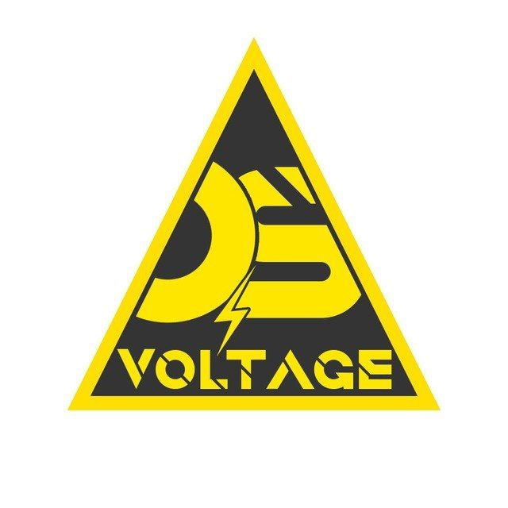

# Voltage OS Moto G84 5G
building Voltage for bangkk



# 
# 
# 
First, we create Voltage directory
```
mkdir ~/voltage && cd ~/voltage
```
Repo Init
```
repo init -u https://github.com/VoltageOS/manifest.git -b 16.2 --git-lfs
```
Sync
```
repo sync -c -j6 --force-sync --no-clone-bundle --no-tags
```

# 
# 
# Cloning tree


NFC
```
git clone https://github.com/VoltageBangkk/android_hardware_samsung_slsi_nfc.git -b 16.2 hardware/samsung/slsi/nfc
```
Vendor common
```
git clone https://github.com/VoltageBangkk/proprietary_vendor_motorola_sm6375-common.git -b 16.2 vendor/motorola/sm6375-common
```
Vendor
```
git clone https://github.com/VoltageBangkk/proprietary_vendor_motorola_bangkk.git -b 16.2 vendor/motorola/bangkk
```
Kernel
```
git clone https://github.com/VoltageBangkk/android_kernel_motorola_sm6375.git -b 16.2 kernel/motorola/sm6375
```
Hardware
```
git clone https://github.com/VoltageBangkk/android_hardware_motorola.git -b 16.2 hardware/motorola
```
Device Common
```
git clone https://github.com/VoltageBangkk/android_device_motorola_sm6375-common.git -b 16.2 device/motorola/sm6375-common
```
Device
```
git clone https://github.com/VoltageBangkk/android_device_motorola_bangkk.git -b 16.2 device/motorola/bangkk
```
# 
# Dolby Sony
```
git clone https://github.com/VoltageBangkk/vendor_sony_dolby.git -b 16.2 vendor/sony/dolby
```
# 
# 
# Build
```
. build/envsetup.sh
  ```
```
brunch bangkk
```
# 
# 
# Adding maintainer & SmartPixels to build
https://github.com/ZedissPp/android_device_motorola_bangkk/commit/99c61ef91343f0ec0f8e5f09b0edaa7e188dfa00
#
# &
#
https://github.com/ZedissPp/android_device_motorola_bangkk/commit/b3a57db11c73ed47e48ccb9f46b1a17e863a6ba9
# 
# For GApps
https://github.com/MindTheGapps/16.0.0-arm64/releases
# 
build guide by {ZedissPp}(https://github.com/ZedissPp)
Come say hi in our Telegram group!
https://t.me/zedisspechat
# 
